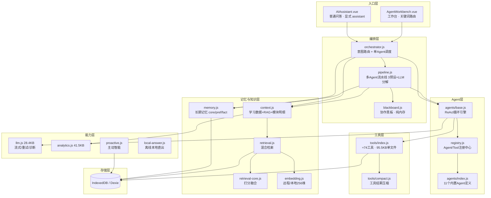
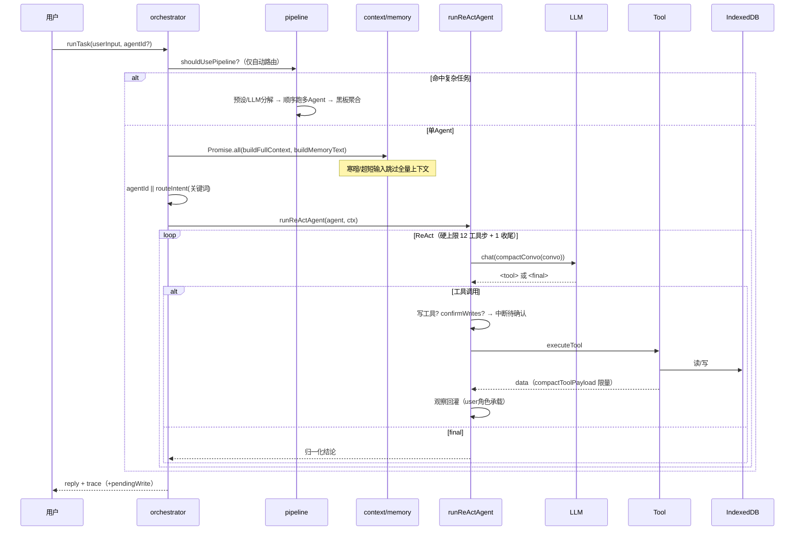
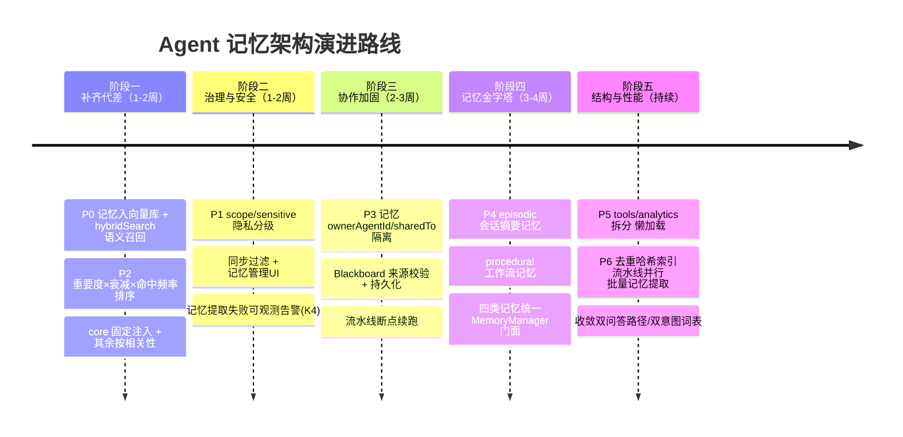
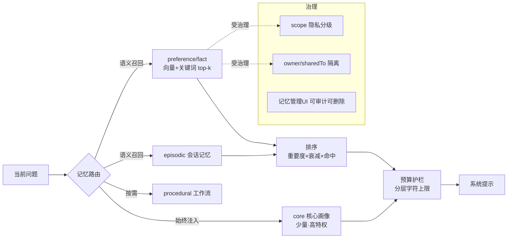

# Agent 体系架构评估与企业级记忆架构演进报告

> 评估对象：`src/agent/`（记忆卡片 PWA 的智能体子系统）
> 评估方式：源码静态审计（编排层 / Agent 层 / 工具层 / 记忆与检索层 / 能力层）
> 评估日期：2026-09-17
> 结论口径：本报告所有数字、常量、文件位置均来自当前源码，非估算。

---

## 0. 执行摘要（先看结论）

这套 Agent 体系在**单机 PWA、零服务器、IndexedDB 本地存储**的约束下，已经做到了相当完整的"多智能体 + ReAct 工具调用 + RAG 检索 + 分层长期记忆 + 多 Agent 流水线"形态，工程护栏（上下文封顶、步数硬上限、写入门禁、离线兜底、OOM 护栏）密度很高，明显是被真实使用反复打磨过的，不是 demo。

但它离"最顶级企业级记忆架构"还有一个**核心代差**：

> **知识（卡片/文档）已经用上了"语义+关键词混合检索"，而关于用户的长期记忆（aiMemories）却还停留在"按时间倒序固定注入"——记忆不会按当前问题被相关性召回，只会被新记忆按时间挤出。** 项目里现成的 embedding 基建（`embeddings` 表、`hybridSearch`、本地 256 维降级）完全没有被记忆层复用。

一句话：**大脑的"知识库"会按需翻书，"关于你的记忆"却只会按日期摊开最近的几页。**

其余主要问题集中在工程结构（两个巨型文件）、记忆治理（无衰减/无语义召回/无 agent 隔离/无隐私分级）、以及多 Agent 协作的持久化（黑板纯内存）。

**总体可维护性评价：当前自用/小团队可用且健壮；若要作为"企业级记忆中台"对外交付或长期演进，记忆检索与治理是必须补的第一课，其余为渐进式重构。**

---

## 1. 整体架构与模块划分

### 1.1 分层视图



### 1.2 模块清单与职责（含体积信号）

| 层 | 文件 | 体积 | 职责 | 结构信号 |
|---|---|---|---|---|
| 编排 | orchestrator.js | 9.1KB | 意图路由、上下文装配、单 Agent 调度 | 清晰 |
| 编排 | pipeline.js | 10.9KB | 多 Agent 流水线（3 预设 + LLM 动态分解） | 清晰 |
| 编排 | blackboard.js | 3.8KB | 多 Agent 共享黑板 | 纯内存、无隔离 |
| Agent | registry.js | 2.7KB | Agent/Tool 运行时注册中心 | 清晰、可扩展 |
| Agent | agents/base.js | 20.9KB | ReAct 循环、工具执行、确认门、上下文压缩 | 偏重但内聚 |
| Agent | agents/index.js | 14.8KB | 11 个 Agent 的 prompt/工具/步数声明 | 清晰 |
| 工具 | **tools/index.js** | **95.5KB** | **≈74 个工具全部集中在一个文件** | **巨型文件** |
| 工具 | tools/compact.js | 6.2KB | 工具回包压缩规则 | 清晰 |
| 记忆 | memory.js | 6.8KB | 长期记忆 CRUD/去重/裁剪/提取 | 检索弱 |
| 记忆 | context.js | 16KB | 学习数据/RAG/完整卡片/模块明细注入 | 多函数有重叠查询 |
| 知识 | retrieval.js | 15.4KB | chunk、索引、混合检索 | 清晰、护栏完善 |
| 知识 | retrieval-core.js | 3.3KB | 语义/关键词打分与融合 | 清晰 |
| 知识 | embedding.js | 7.3KB | 远程 embedding + 本地 256 维降级 | 清晰 |
| 能力 | **analytics.js** | **41.5KB** | 学习分析/能力四维/模块汇总 | **巨型文件** |
| 能力 | llm.js | 28.4KB | LLM 客户端、流式、重试、用量 | 偏重 |
| 能力 | proactive.js | 15KB | 主动建议（调度器+通知+规则引擎） | 清晰 |
| 能力 | local-answer.js | 6KB | 用已取数据本地直出兜底 | 清晰 |

**模块划分评价**：分层边界是清楚的（编排 / Agent / 工具 / 记忆知识 / 能力），依赖方向基本单向向下，`registry.js` 提供了运行时扩展点（插件可 `registerTool/registerAgent`），这是好的设计。主要结构债是**两个巨型文件**（tools/index.js、analytics.js）和**记忆逻辑在概念上分散**（长期记忆在 memory.js、工作记忆在 base.js、协作记忆在 blackboard.js、知识检索在 retrieval.js，但没有一个统一的"记忆门面"把它们组织成显式分层）。

---

## 2. 组件交互与调用链路

### 2.1 单 Agent 主链路（普通问答 / 工作台）



### 2.2 关键设计决策（来自源码，值得肯定）

1. **文本协议工具调用而非原生 function calling**：用 `<tool>/<args>` 文本协议，工具观察用 `role:'user'` + 内部标记承载（`toolObservation`，base.js:172）。原因注释写得很清楚——`role:'tool'` 在没有 `tool_calls`/`tool_call_id` 时会被 OpenAI/DeepSeek 端点直接 400。这个决策让系统能接任意 OpenAI 兼容端点，是务实的兼容性选择。
2. **步数硬上限**：`maxSteps = min(agent.maxSteps, 12)`，外加 1 个"只收尾不调工具"的格（base.js:235-251），防止插件 manifest 自报 9999 导致费用爆炸；剩余工具机会 ≤2 时主动提示模型收敛。
3. **上下文总量封顶**：`CONVO_CHAR_BUDGET = 48000` 字符，只压缩工具观察/助手原文等可再生中间产物，**绝不截断 system/user**（base.js:181）。
4. **四条失败出口都先抢救数据**：LLM 异常、离线占位、步数耗尽、无数据，都会先用 `buildLocalAnswer(observations)` 把已拿到的真实数据本地直出，而不是回一句"暂不可用"（base.js:268/336/363）。
5. **写入确认门**：`tool.writesData && ctx.confirmWrites` 时返回 `needsConfirm` 中断循环，`approvedWrite` 一次性放行（base.js:125-131）。
6. **流式默认 + 空闲超时**：Agent 长输出不再被"整段 60s"误杀（orchestrator.js:129）。
7. **RAG 内存护栏**：全库 embedding 载入超 `FULLSCAN_ROW_LIMIT=3000` 行（1536 维 ×3 万 ≈180MB）直接报错逼调用方限范围，而非默默 OOM（retrieval.js:220-244）。

### 2.3 多 Agent 流水线（pipeline.js）

- 3 条预设：`deep-learn`（组卡→讲解→测试→分析）、`review-consolidate`（找薄弱→补卡→清单→计划）、`exam-sprint`（诊断→模考→错题分析→计划），每条固定 4 步。
- 非预设复杂任务由 LLM 动态分解为 `{agent, instruction}` 序列。
- Agent 之间通过**黑板**（findings/artifacts/messages/subtasks）累积信息，最后 LLM 聚合。
- **执行方式是顺序串行，不是并行**；失败回退单 Agent。

---

## 3. 数据流

```mermaid
flowchart LR
    subgraph 写入侧
        Q[用户对话] --> EX[extractMemories<br/>LLM提取器]
        EX --> ADD[addMemory<br/>去重/重要度]
        T2[工具写入] --> CARDS[(cards/notes/plans...)]
        CARDS --> IDX[ensureIndex<br/>增量embedding]
        IDX --> VEC[(embeddings)]
    end

    subgraph 读取侧（每轮）
        Q2[用户问题] --> SC[buildStudyContext<br/>stats/weak/tags/模块]
        Q2 --> RAG[buildRAGContext<br/>hybridSearch topK=6]
        Q2 --> QC[buildQuestionCardContext<br/>完整卡 top8]
        Q2 --> MN[buildModuleNodesContext<br/>按意图下饭 预算16000字]
        MT[buildMemoryText<br/>时间倒序44条/1800字] --> SYS[系统提示]
        SC --> SYS
        RAG --> SYS
        QC --> SYS
        MN --> SYS
        SYS --> AGENT[ReAct]
    end

    ADD --> MEM[(aiMemories)]
    MEM --> MT
```

**读取侧的上下文由 5 路拼成**（这是理解记忆架构的关键）：

| 上下文来源 | 函数 | 检索方式 | 上界 |
|---|---|---|---|
| 学习数据概览 | buildStudyContext | 固定统计 | 5 个库查询 |
| 知识 RAG | buildRAGContext | **混合检索（语义0.65+关键词0.35）** | topK=6 |
| 完整卡片（普通问答） | buildQuestionCardContext | 关键词优先+语义兜底 | top8，单卡1200字 |
| 模块明细 | buildModuleNodesContext | 按意图下饭 | 总预算16000字 |
| **长期记忆** | buildMemoryText | **updatedAt 时间倒序** | 12+12+20条，1800字 |

**注意这张表的不对称**：知识类上下文全部走语义检索，唯独"关于用户的长期记忆"是时间倒序——这是后文记忆专章的核心。

---

## 4. 扩展性与可维护性

### 4.1 做得好的

- **注册中心模式**：`registry.js` 的 `ToolRegistry/AgentRegistry` 支持运行时 `register/unregister`，注释明确面向"插件、第三方扩展、用户脚本"，Agent 通过 `tools:[...]` 白名单声明能力，是标准的能力装配方式。
- **Agent 声明式定义**：11 个 Agent 只是 `{id, name, prompt, tools, maxSteps}` 的数据，新增 Agent 成本低。
- **LLM/Embedding 适配器化**：任意 OpenAI 兼容端点可配，embedding 有本地降级，离线可用。
- **护栏参数集中且常量化**：步数、字符预算、记忆上限、chunk 长度、全表扫描上限都有命名常量并注释来历。

### 4.2 可维护性债务

| 问题 | 位置 | 影响 |
|---|---|---|
| **工具层单文件 95.5KB / ≈74 工具** | tools/index.js | 改任一工具都要在巨型文件里定位；合并冲突高发；无法按域懒加载 |
| **analytics.js 41.5KB** | analytics.js | 统计/能力四维/模块汇总/考试分析混杂 |
| **记忆无统一门面** | memory/blackboard/base/retrieval 分散 | 系统里实际存在 4 类记忆，但没有显式的 MemoryManager 抽象，演进时要改多处 |
| **两套意图词表** | orchestrator.INTENT_RULES 与 utils/query-intent.wantedModules | 关键词路由和模块下饭各维护一份词表，易漂移 |
| **chatWithFallback 重复实现** | orchestrator.js:20 与 pipeline.js:23 | 同一段离线兜底逻辑复制两份（为切断循环依赖），应抽到独立模块 |
| **两条问答路径并存** | assistant 工具循环 vs 工作台关键词路由 | 行为、上下文、确认门不一致，长期应收敛到一条 |

---

## 5. 瓶颈、冗余与风险

### 5.1 性能瓶颈

| 编号 | 瓶颈 | 位置/常量 | 成因 | 影响 |
|---|---|---|---|---|
| B1 | **长期记忆全表去重扫描** | memory.js:43 `db.aiMemories.toArray().find()` | 每次 addMemory 都物化全表做归一化匹配 | 300 条内尚可，达上限后每轮提取都 O(n) |
| B2 | 全库语义检索全表载入 | retrieval.js，上限 3000 行 | 客户端单机向量计算，无 ANN 索引 | 超 3000 行只能限范围，跨科目全库检索被硬限制 |
| B3 | pipeline 4 步串行 | pipeline.js | 顺序执行，每步独立 ReAct + LLM | 一条深度学习流水线 = 4×（多次 LLM 往返），延迟叠加 |
| B4 | buildStudyContext 每轮 5 查询 | context.js:23 | stats/weak/suggestion/tags/moduleSummary | 已有寒暄跳过缓解，但实质问题每轮照付 |
| B5 | 每轮对话后一次记忆提取 LLM 调用 | extractMemories | 独立"记忆提取器"子调用 | 额外延迟与 token 成本（失败静默） |

### 5.2 冗余

- **R1**：`chatWithFallback` 在 orchestrator/pipeline 各一份。
- **R2**：上下文多函数重复查询（getStats/weakCards 在 buildStudyContext 与 getStructuredContext 各查一次）。
- **R3**：两套意图关键词表（见 4.2）。
- **R4**：普通问答的"完整卡注入"（buildQuestionCardContext）与 Agent 的 `get_card_detail` 工具能力重叠——一个靠预注入、一个靠工具取，存在两套取卡逻辑。

### 5.3 风险（含正确性/健壮性）

| 编号 | 风险 | 位置 | 说明 |
|---|---|---|---|
| K1 | **记忆随同步包跨设备，含敏感画像却无分级** | memory.js + sync | core 记忆含身份/目标，随包外发；无"本机私有/不同步"标记 |
| K2 | 黑板纯内存不持久化 | blackboard.js | pipeline 中途失败/刷新，协作 findings 全丢，无法断点续跑 |
| K3 | 记忆无冲突历史 | memory.js:47 | 重复记忆只 `put` 覆盖并取 `max(importance)`，旧表述被静默替换，无版本 |
| K4 | 记忆提取失败静默 | memory.js:141 catch→0 | 提取器异常用户无感，记忆可能长期不增长且无告警 |
| K5 | 关键词路由脆弱 | orchestrator.routeIntent | 工作台仍靠 `includes` 匹配，同义改写/否定句可能误路由（普通问答已改 assistant 工具循环规避） |
| K6 | 黑板无写权限隔离 | blackboard.js | 任何 Agent 可覆盖任意 artifact key、可伪造任意 from 的 message |
| K7 | 记忆注入与问题无关 | buildMemoryText | 时间倒序固定注入，无关记忆占预算、相关老记忆被挤出（详见第 6 章） |

---

## 6. 记忆架构专章（重点）

### 6.1 现状：实际存在的"四层记忆"（但未被显式建模）

| 层 | 载体 | 生命周期 | 容量策略 | 检索方式 | 持久化 |
|---|---|---|---|---|---|
| L0 工作记忆 | ReAct 的 convo + observations | 单轮 | 48000 字符封顶，只压中间产物 | 全量在窗 | 否 |
| L1 协作记忆 | Blackboard（findings/artifacts/messages/subtasks） | 单次流水线会话 | findings 取最近 8 条、单条 200 字 | 顺序/按 key | **否（纯内存）** |
| L2 长期用户记忆 | db.aiMemories（core/preference/fact） | 跨对话、跨设备 | 300 行硬上限；注入 12/12/20 条、单条120字、共1800字 | **updatedAt 倒序** | 是（随同步包） |
| L3 知识记忆 | db.embeddings（卡片/文档 chunk） | 长期 | chunk 500字+50重叠；全表 3000 行护栏 | **语义0.65+关键词0.35 混合** | 是 |

> 另有"业务数据上下文"（stats/weak/模块明细）作为事实层注入，但它不是记忆，是实时查询。

### 6.2 存储与检索机制

**存储**：全部落 IndexedDB（Dexie），`aiMemories` 索引为 `id, updatedAt, category`；`embeddings` 索引含 `sourceType/sourceId/subject/chunkIdx/modelSig`。零服务器，随数据包同步。

**长期记忆写入链路**：每轮对话后 `extractMemories` 用独立 LLM 提取器输出 JSON 数组 → `addMemory` 归一化（去空白+小写）全表查重 → 命中则刷新 `updatedAt` 并取 `max(importance)`，否则插入 → `pruneMemories` 超 300 删最旧并写墓碑防同步复活。

**长期记忆读取链路**：`listMemories(200)` 按 updatedAt 倒序 → 扫描凑满 core12/preference12/fact20 → 单条截断 120 字 → 总量 1800 字护栏（超了按 fact→preference 顺序丢，core 最后丢）。

**知识检索链路**（成熟）：chunk → embedding（远程 text-embedding-3-small，或本地 256 维 bigram 哈希降级）→ 存表；查询时 `hybridSearch` 语义余弦 + BM25 式关键词，各取 topK×3 后 `fuseResults` rerank。

### 6.3 与"顶级企业级记忆架构"的核心差距

这是本报告最重要的一节。对照业界成熟的 Agent 记忆体系（分层记忆 + 向量召回 + 记忆治理 + 可控共享），差距按重要度排列：

#### 差距①（决定性）：长期记忆"只按时间排序"，没有语义召回

- **现状**：`buildMemoryText` 无视用户当前问题，永远注入"最近被刷新的 44 条"。
- **后果**：
  - 用户 3 个月前说过"我考研数学一、目标院校专业课考数据结构"，只要最近聊了 44 条别的，这条**最关键的 core 记忆也会被挤出**（core 上限仅 12）。
  - 与当前问题高度相关的 preference/fact 因为"不够新"不被注入；无关的新记忆反而占位、白付 token。
- **讽刺点**：项目**已经建好**了完整的向量混合检索（embeddings 表 + hybridSearch + 本地降级 + 维度不一致检测 + 模型签名重建），却只给卡片/文档用，没给记忆用。
- **企业级做法**：记忆也 chunk 化入向量库；每轮用当前问题对记忆做语义检索取 top-k；少量 core 画像保持"始终注入"，其余按相关性召回。

#### 差距②：没有遗忘/衰减/巩固模型

- **现状**：只有"300 条硬裁剪 + updatedAt 刷新 + 静态 importance（默认 2）"。
- **缺失**：没有时间衰减、没有访问频率强化、没有"被检索命中即增强"的巩固机制、没有事实过期（用户目标会变，旧目标不会自动失效）。
- **后果**：记忆价值是二元的（在/不在），不会"越用越牢、久不访问自然淡出"；过期事实可能误导。

#### 差距③：没有情景记忆（Episodic）与程序记忆（Procedural）

- **现状**：只有"语义记忆"（关于用户的事实）。
- **缺失**：
  - 情景记忆：对话/学习会话的摘要（"上周三我们系统过了海明码，错题集中在 GBN"）——当前聊完即散，只有 proactive 做了一点规则化。
  - 程序记忆：用户偏好的工作流/解题套路/工具使用习惯（"这个用户喜欢先出 A-D 选择题且先不给答案"其实是 preference，但"如何为他组织一次复习"这种流程性知识无处安放）。

#### 差距④：多 Agent 共享与隔离是"全有或全无"

- **现状**：aiMemories 表**没有 agentId/scope 字段**，11 个 Agent 共享同一份记忆；Blackboard 在单次流水线内完全共享且无权限隔离。
- **问题两面性**：
  - 该共享的（用户画像）共享是对的；
  - 但缺少"某 Agent 的私有工作记忆"（mistake-analyst 对错题模式的中间判断不该污染全局画像），也缺少"某记忆只对特定 Agent 可见"。
  - Blackboard 上任何 Agent 能覆盖他人 artifact、伪造他人 message（K6）。

#### 差距⑤：隐私与权限控制缺失

- **现状**：记忆随同步包跨设备/中枢；无字段级可见性、无敏感标记、无"仅本机"分级；用户没有记忆的查看/编辑/导出/删除治理界面（代码里有 listMemories/deleteMemory API，但无分级）。
- **企业级要求**：记忆级 scope（local/device/synced/encrypted）、敏感字段脱敏、按 Agent 的读写授权、用户可审计（GDPR 式记忆透明）。

#### 差距⑥：记忆一致性是"最后写入胜出"，无版本/无冲突合并

- **现状**：fieldTs 预留了字段级时间戳，但去重命中后直接 put 覆盖、importance 取 max；多设备并发编辑同一记忆没有真正的字段级合并（fieldTs 注释自承"为将来预留"，尚未实现）。

### 6.4 记忆与业务系统的集成现状（集成是优点）

记忆不是孤岛，和业务集成度其实不错，这是要保留的底子：

- **记忆 → 注入**：buildMemoryText 进系统提示，所有 Agent 可见。
- **业务数据 → 上下文**：buildStudyContext 实时拉 stats/薄弱卡/标签/模块汇总，Agent 基于事实而非幻觉。
- **记忆 → 主动智能**：proactive.js 基于本地数据规则优先、AI 增强每日一次推送建议。
- **记忆 → 同步**：随数据包跨设备（这同时是能力也是隐私风险 K1）。
- **工具 → 业务**：74 个工具直接读写 cards/notes/plans/docs/graph 等业务表，Agent 是真能干活的，不是只聊天。

---

## 7. 优化方案（优先级 / 预期收益 / 代价）

> 优先级原则：先补"决定性代差"和低风险高收益项，再做结构重构；全部基于本项目单机 PWA、零服务器、单用户（暂未多租户）的真实约束，不照搬云端多租户重型方案。

### P0 — 记忆语义召回（最高优先，复用现成基建，性价比最高）

- **做法**：
  1. 给 aiMemories 增加向量字段（或在 embeddings 表以 `sourceType:'memory'` 建向量，复用现有索引/重建/降级链路，**不新造轮子**）。
  2. addMemory 时同步生成 embedding；prune/delete 时级联清理。
  3. 新增 `retrieveMemories(query)`：core 层少量（如 6-8 条）始终注入；preference/fact 走 hybridSearch 按当前问题取 top-k。
  4. buildMemoryText 改为 `core 固定 + 语义相关 preference/fact`，保留 1800 字总护栏。
- **收益**：直接消除核心代差，相关老记忆不再被时间挤出；无关记忆不再占预算；用户最直观感受到"它真的记得我"。
- **代价**：中。主要工作是记忆入索引 + 检索函数 + 一次性回填（给存量 300 条补向量，可复用 ensureIndex 增量模式）。检索基建全现成。
- **风险点**：记忆条数远少于卡片，全表载入也不会触 3000 上限，性能无忧；需处理本地/远程 embedding 切换时的模型签名重建（已有机制）。

### P1 — 记忆隐私分级与治理

- **做法**：aiMemories 加 `scope`（local-only / synced）与 `sensitive` 标记；同步层过滤 local-only；提供记忆管理 UI（查看/编辑/删除/标记）。
- **收益**：堵住 K1（身份/目标类记忆裸同步）；满足记忆透明与可删除；为将来多设备/共享打基础。
- **代价**：低-中（加字段 + 同步过滤 + 一个简单管理页）。
- **注意**：schema 变更要走同步兼容（旧数据默认 synced 还是 local 需定策略，建议默认 local 更安全，用户显式选择同步）。

### P2 — 记忆衰减 / 巩固 / 过期

- **做法**：排序分 = 静态 importance × 时间衰减因子 ×（1 + ln(命中次数)）；每次语义召回命中就累加 hitCount 并刷新 lastAccessed；支持事实 TTL/失效（如"本次考试目标"考后归档）。
- **收益**：记忆从"二元在不在"升级为"越用越牢、自然淡出"，显著降低过期事实误导，缓解 300 条硬裁剪的粗暴。
- **代价**：低（排序公式 + 两个计数字段），可在 P0 检索函数里直接落地。

### P3 — 多 Agent 记忆隔离 + 黑板加固/持久化

- **做法**：
  1. 记忆加 `ownerAgentId`（可空=全局用户画像）与 `sharedTo` 白名单；全局画像共享、Agent 中间判断私有。
  2. Blackboard 写入带来源校验（artifact key 加 owner、message 防伪造）；把黑板快照落 IndexedDB（流水线 id 为 key），支持失败后断点续跑/人工查看。
- **收益**：解决 K2/K6；让多 Agent 协作可恢复、可审计，私有判断不污染画像。
- **代价**：中（黑板持久化要设计生命周期与清理，避免垃圾堆积）。

### P4 — 补齐情景记忆与程序记忆

- **做法**：会话结束 LLM 生成 episodic 摘要入"会话记忆"表（带时间/主题/涉及卡片），同样入向量检索；把用户反复确认的工作流沉淀为 procedural 记忆（可先只做规则模板）。
- **收益**：形成完整的"短期→情景→语义→程序"记忆金字塔；支撑"上周我们学了什么"这类跨会话回忆。
- **代价**：中-高（新表 + 摘要时机 + 检索融合），建议在 P0/P2 稳定后做。

### P5 — 工程结构重构（可与上述并行，不阻塞功能）

- **做法**：
  1. tools/index.js 按域拆分为 `tools/card.* / plan.* / analytics.* / memory.* / rag.* / crud.*`，index.js 只做聚合注册；为按域懒加载留口。
  2. analytics.js 拆为 stats / ability / module / exam 四块。
  3. 抽 `services/llm-fallback.js` 消除两处 chatWithFallback 重复（R1）。
  4. 统一意图词表（合并 INTENT_RULES 与 wantedModules 到一份声明）。
  5. 引入统一 `MemoryManager` 门面，把工作/协作/长期/知识四类记忆显式组织，后续记忆演进只改门面。
- **收益**：可维护性、合并冲突、按需加载（顺带减首屏包体，当前 entry 1446KB）。
- **代价**：中（纯搬移 + import 调整，风险低但面广，需测试兜底——当前 1398 测试是安全网）。

### P6 — 性能与成本优化

- **做法**：addMemory 去重改为归一化哈希索引（消除 B1 全表扫）；pipeline 无依赖步骤并行（B3）；记忆提取改为"攒 N 轮批量提取一次"或低优先级空闲执行（B5）；上下文查询结果在单轮内缓存复用（R2/R4）。
- **收益**：降延迟、降 token、减少卡顿。
- **代价**：低-中。

### 优化项总览（收益/代价矩阵）

| 项 | 优先级 | 预期收益 | 改造代价 | 风险 | 建议节奏 |
|---|---|---|---|---|---|
| 记忆语义召回 | **P0** | 极高（补核心代差） | 中（基建现成） | 低 | 立即 |
| 记忆隐私分级+治理 UI | P1 | 高（堵隐私洞） | 低-中 | 中（同步兼容） | 紧随 P0 |
| 衰减/巩固/过期 | P2 | 高（记忆质量） | 低 | 低 | 与 P0 同批 |
| Agent 隔离+黑板持久化 | P3 | 中-高（协作可靠） | 中 | 中 | 中期 |
| 情景/程序记忆 | P4 | 高（记忆金字塔完整） | 中-高 | 中 | 中期 |
| 巨型文件拆分+记忆门面 | P5 | 中（可维护性） | 中（面广） | 低（有测试网） | 持续重构 |
| 性能/成本 | P6 | 中 | 低-中 | 低 | 随手优化 |

---

## 8. 演进路线（分阶段）



**目标态记忆架构**：



---

## 9. 明确结论

1. **当前状态**：在单机 PWA 约束下，这是一套**架构成熟度高于一般课程设计/个人项目**的 Agent 系统——分层清晰、护栏密集、扩展点齐备、RAG 与离线兜底做得扎实，**自用和小范围使用是可靠的**（1398 测试通过也印证了工程质量）。
2. **最关键短板只有一个**：长期记忆**没有语义召回**，与已建成的知识检索能力形成明显代差；这是"好用的工具型 Agent"与"真正懂用户的企业级记忆 Agent"之间的分水岭，且**修复性价比极高（基建全现成）**，应作为 P0 立即做。
3. **第二梯队**是记忆治理（隐私分级、衰减、Agent 隔离、黑板持久化），决定系统能否安全地长期沉淀用户数据、能否支撑可靠的多 Agent 协作。
4. **第三梯队**是工程结构债（两个巨型文件、重复兜底、双路径/双词表），不影响正确性，但影响长期迭代效率，靠现有测试网渐进重构即可。
5. **不建议**在单用户、零服务器阶段照搬云端多租户的重型记忆中台（独立记忆微服务、向量数据库集群、复杂 ACL）；当前 IndexedDB + 复用 embeddings 表 + 单 MemoryManager 门面，已足够支撑到万级卡片/千级记忆的规模。

---

*附：本报告基于的关键源码常量——ReAct MAX_STEPS=12(+1收尾)、CONVO_CHAR_BUDGET=48000、记忆 MEM_MAX_ROWS=300/注入12·12·20/单条120字/总量1800字/扫描200、RAG chunk500+50重叠/batch16/语义0.65+关键词0.35/FULLSCAN_ROW_LIMIT=3000、本地向量256维、完整卡top8/单卡1200字、模块明细预算16000字、RAG topK=6、history.slice(-12)、内置 Agent 11 个、工具约 74 个。*
