# Personalized Spaced Repetition with Finite-Difference Training and Calibration Feedback: A Local, Privacy-Preserving Implementation

**Target venue/format:** IEEE Conference / IEEE Transactions on Learning Technologies–style manuscript (IEEEtran, 10 pt, double column)

**Length:** ~7,000 words (excluding references and figures)

**Language:** Academic English

---

## Abstract

Spaced repetition (SR) improves long-term retention by scheduling reviews just before a memory is likely to be forgotten. Recent machine-learned schedulers such as FSRS have shown that trainable forgetting models can outperform the classic SM-2 heuristic, but most implementations rely on analytic gradients and cloud-based training, which raises privacy, offline-use, and engineering-barrier concerns. We present an SR architecture built on the FSRS-4.5 memory model with three contributions: (1) a finite-difference gradient-descent trainer that personalizes the 19 model weights locally without analytic gradients or server round-trips; (2) a calibration feedback loop that continuously estimates ECE, Brier score, and bias from the learner's review history and automatically adjusts the target retention to compensate for distribution shift; and (3) an adaptive retention policy that sets a subject-specific target retention based on the learner's mastery level. We evaluate the system through large-scale, deterministic simulation experiments that use a synthetic ground-truth memory model with individual differences, together with an independent academic-integrity audit. The finite-difference trainer reduces log-loss from 0.696 to 0.603 on 5,700-sample histories and generalizes out-of-sample (test gain 0.073, d_z = 4.09). A memory-consistent calibration test yields near-zero ECE (0.0072) that rises monotonically under model mismatch, confirming the metric is discriminative rather than vacuous. FSRS with default weights raises retention over SM-2 (0.907 vs. 0.898) while reducing total reviews by 8.67% [95% CI 6.77–10.72]; in a retention-matched analysis the savings persist (10.15% and 23.20% for two rating conventions). Under severe distribution shift, the calibration feedback loop raises retention by +3.6 percentage points (d_z = 4.34). An out-of-family ground-truth test, in which FSRS has no home-field advantage, reveals that FSRS trades a +7.5-point retention gain for 15.1% more reviews—a result reported transparently as an external-validity bound. All experiments are deterministic, reproducible, and independently re-implemented for verification.

**Keywords:** spaced repetition, FSRS, forgetting curve, calibration, adaptive learning, finite-difference optimization, privacy-preserving education technology, reproducibility.

---

## I. Introduction

Effective learning is cumulative: new knowledge must be retained over semesters or years before it can be applied in examinations and professional practice. Yet human memory decays predictably after initial exposure. Ebbinghaus's seminal work on the forgetting curve showed that retention drops rapidly at first and then more slowly over time [1]. Spaced repetition (SR) takes advantage of this regularity by presenting reviews at expanding intervals, so that material is rehearsed when it is close to being forgotten but not yet lost. Compared with massed practice, SR can substantially improve long-term retention for the same total study time [2].

The classic implementation of spaced repetition in educational software is the SM-2 algorithm developed by Wozniak in the 1980s and popularized by Anki [3]. SM-2 tracks an interval and an ease factor for each card. After each review, the interval is multiplied by the ease factor, and the ease factor is adjusted up or down depending on the user's self-reported performance. SM-2 is simple, interpretable, and has been the default scheduler in Anki for nearly two decades. However, it is essentially a one-size-fits-all heuristic: its parameters were tuned once and are not updated to match an individual learner's memory dynamics. Users have also reported "ease hell," in which repeated Hard ratings drive the ease factor toward its floor and produce an endless stream of reviews [4].

Recent research has therefore turned to machine-learned schedulers. Tabibian et al. framed spacing as a sequential decision problem and used a reinforcement-learning scheduler on real review logs [5]. Settles and Meeder proposed a trainable exponential forgetting model and fitted it with gradient descent [6]. In the most directly related work, Ye, Su, and Cao introduced FSRS (Free Spaced Repetition Scheduler), which represents each card by three state variables—Stability $S$, Difficulty $D$, and Retrievability $R$—and optimizes scheduling with a stochastic-shortest-path objective over a fitted memory model [7]. FSRS is now integrated into Anki and has been shown to reduce review load relative to SM-2 in benchmark comparisons [8].

Despite these advances, several practical barriers remain. First, the published FSRS training procedure relies on analytic gradients and backpropagation through time, which require careful engineering and are less tolerant of future model changes [9]. Second, per-user training is typically performed on a server that receives the user's full review history, raising privacy concerns for learners in sensitive domains (e.g., medical or legal education). Third, even a well-fitted model can become miscalibrated when the learner's memory dynamics change (fatigue, material difficulty drift, or life events); existing SR systems do not provide a closed-loop mechanism to detect and correct such drift online. Finally, most schedulers use a single global target retention for all subjects, even though a learner may want stricter retention for a new subject and lighter retention for a well-mastered one.

This paper describes the design and empirical evaluation of an SR subsystem that addresses these gaps. Built as part of the SxyBrick offline-first study application (Vue3 + Vite + IndexedDB PWA), the subsystem reimplements the FSRS-4.5 memory model and adds three components:

1. **Finite-difference training.** Instead of deriving analytic gradients, we estimate the gradient of the log-loss objective with central differences and project weights to a feasible non-negative space. The trainer runs entirely in the browser on the user's local review history, so no data leaves the device.
2. **Calibration feedback loop.** After each review, the system records the predicted retrievability at review time. Periodically, it runs a calibration backtest (ECE, Brier score, bias) and feeds the signed bias into a controller that adjusts the target retention $R^*$. Positive bias means the model is overestimating memory and intervals are too long; the controller raises $R^*$ to make reviews more frequent.
3. **Adaptive retention.** The target retention is mapped from a subject-level mastery score: new material is kept at high retention (0.95), while highly mastered material can be allowed to drift to 0.80, reducing review frequency.

We evaluate these mechanisms through a battery of reproducible simulation experiments that use a synthetic ground-truth memory model with controlled individual differences. In addition, and unusually for a systems paper, we subject our own results to an independent academic-integrity audit that re-implements the key computations from scratch and checks for fabrication, metric-vacuity, selective reporting, p-hacking, and text–result mismatch (Section V.G and the accompanying audit report). All code, seeds, and results are fixed, so the reported numbers can be regenerated on any machine.

The remainder of this paper is organized as follows. Section II reviews related work. Section III describes the memory model, scheduler, trainer, calibration loop, and adaptive retention policy. Section IV presents the experimental design and reproducibility protocol. Section V reports the results. Section VI discusses implications, threats to validity, and limitations. Section VII concludes.

---

## II. Related Work

### A. Spaced Repetition and Memory Models

The theoretical basis for spaced repetition is the spacing effect: information reviewed at increasing intervals is retained better than the same amount of practice massed together [2]. Early computational models included Pimsleur's memory schedule [10] and Wozniak and Gorzelanczyk's two-component model of stability and retrievability [11]. SM-2 operationalized these ideas into a practical interval-multiplication rule and became the dominant algorithm in flashcard software [3]. However, SM-2 has no mechanism to learn per-user or per-card parameters from data; its performance therefore depends on the extent to which the global default parameters match the learner's memory dynamics.

### B. Machine-Learned Schedulers

More recent work has treated scheduling as a learning problem. Reddy, Labutov, and Banerjee modeled forgetting with a half-life regression and optimized a review schedule by gradient descent [12]. Settles and Meeder proposed a hierarchical Bayesian model of an exponential forgetting curve and showed that a fitted model could outperform SM-2 on review log data [6]. Tabibian et al. used a Gaussian-process value function and reinforcement learning to optimize review timing on real review logs [5].

FSRS, introduced by Ye, Su, and Cao, is the closest point of comparison [7], [9]. FSRS represents each card by Stability, Difficulty, and Retrievability, and updates them with parametric equations after each review. The model is trained on the user's full review history to minimize log-loss between predicted and observed recall. In follow-up work, Su et al. extended the model and showed that capturing memory dynamics with a power-law forgetting curve improves prediction on large-scale Anki logs [8].

Our work differs from these prior approaches in three ways. First, we use finite-difference gradients rather than analytic gradients, which makes the training code simpler to maintain and robust to future changes in the update equations. Second, we add an explicit calibration feedback loop that detects miscalibration after deployment and adjusts the target retention without retraining the full model. Third, we integrate a per-subject adaptive retention policy that trades retention against review load based on mastery.

### C. Calibration and Adaptive Learning

In machine learning, a model is calibrated when its predicted probabilities match observed frequencies [13]. Miscalibration in SR is particularly harmful: if the model overestimates retrievability, it schedules reviews too far apart, and actual retention falls below target. Calibration is usually assessed with reliability diagrams, Expected Calibration Error (ECE), and Brier score [14]. Few SR systems, however, close the loop by using calibration metrics to change the scheduling policy in real time.

Adaptive difficulty and mastery-based learning have long histories in intelligent tutoring systems. Corbett and Anderson's Knowledge Tracing estimated latent mastery from binary practice outcomes and used it to select the next problem [15]. In spaced repetition, learners typically choose a single global difficulty target; our adaptive retention policy can be viewed as a lightweight subject-level adaptation of the same idea.

---

## III. Methodology

### A. Memory Model

Our implementation follows the FSRS-4.5 three-variable memory model. Each card carries a state $(S, D, \text{reps}, \text{last})$, where:

- $S \geq 0.1$ is **Stability**, measured in days.
- $D \in [1, 10]$ is **Difficulty**.
- $\text{reps}$ counts completed reviews.
- $\text{last}$ is the timestamp of the last review.

Given elapsed time $t$ in days since the last review, the predicted retrievability is

$$
R(t, S) = \left(1 + \frac{t}{9S}\right)^{-1}.
\tag{1}
$$

Equation (1) is a power-law forgetting curve. When $t = S$, the retrievability is $0.9$ by construction, which motivates the definition of stability as the number of days until retrievability drops to 90%.

The learner provides a rating $r \in \{0, 1, 2\}$, mapped internally to an FSRS grade $g \in \{1, 2, 3\}$ ($0 \rightarrow 1$ "again," $1 \rightarrow 2$ "hard," $2 \rightarrow 3$ "good"). On the first review, stability and difficulty are initialized from grade-dependent weights $w_0 \ldots w_6$:

$$
S_0 = \text{initStability}(g, w), \qquad D_0 = \text{initDifficulty}(g, w).
\tag{2}
$$

On subsequent reviews, $S$ and $D$ are updated using the recall and difficulty equations:

$$
S' = \begin{cases}
\text{stabilityAfterForget}(S, D, R, w), & g = 1,\\
\text{stabilityAfterRecall}(S, D, R, g, w), & g \geq 2,
\end{cases}
\tag{3}
$$

$$
D' = \text{nextDifficulty}(D, g, w).
\tag{4}
$$

The full update equations involve 19 scalar weights $w_0 \ldots w_{18}$. The default weights were derived from a population-level fit and serve as the cold-start prior.

### B. Scheduling

The scheduler selects the next review date so that the predicted retrievability at review time equals a target retention $R^*$. Inverting Equation (1) gives

$$
\Delta t = 9S\left(\frac{1}{R^*} - 1\right).
\tag{5}
$$

For a failed review ($g=1$), the card is scheduled for the same day with a minimal interval. The implementation also applies a small stochastic fuzz to reduce same-day pile-up; for the controlled experiments reported here, fuzz is disabled (weight $w_{17}=0$) so results are reproducible.

### C. Finite-Difference Training

The model is personalized by fitting the 19 weights to the user's review history. We use a log-loss objective on binary recall outcomes: $y=1$ if the rating is "hard" or "good" ($r \geq 1$) and $y=0$ if the rating is "again" ($r=0$). For a given weight vector $w$, the loss is the average cross-entropy between predicted retrievability and observed outcome over all reviews that have a preceding review on the same card.

Because the update equations combine exponentials, powers, and clamps, analytic gradients are tedious and brittle. We therefore estimate gradients with central differences:

$$
\frac{\partial \mathcal{L}}{\partial w_i} \approx \frac{\mathcal{L}(w + \epsilon e_i) - \mathcal{L}(w - \epsilon e_i)}{2\epsilon},
\tag{6}
$$

with $\epsilon = 10^{-3}$. The gradient vector is normalized by its Euclidean norm, and weights are updated with a fixed learning rate and projected to $w_i \geq 0.01$. Training stops when the loss no longer improves.

Finite-difference training is computationally heavier than analytic gradients ($2 \times 19 = 38$ loss evaluations per gradient step) but is feasible for offline training on histories of a few thousand reviews. More importantly, it decouples the training code from the exact form of the update equations, which simplifies maintenance and experimentation.

### D. Calibration Backtest

For each review after the first on a card, the system records the predicted retrievability $\hat{R}$ computed from the card's state just before the review. This yields a set of pairs $(\hat{R}_j, y_j)$, where $y_j$ is the observed binary outcome.

To handle the fact that the earliest reviews of a card do not have a recorded prediction, the backtest can reconstruct the missing predictions by simulating the FSRS state through the card's history. The reconstructed predictions are marked as simulated and are used only when a recorded prediction is unavailable.

From the complete set of pairs, we compute:

- **Calibration buckets:** group predictions into bins and compare the mean predicted probability with the actual success rate.
- **Expected Calibration Error (ECE):** a weighted average of absolute differences between predicted and observed rates across bins (micro-averaged, weighted by bucket size).
- **Macro-ECE:** an unweighted mean of the absolute bucket-wise differences, which is more sensitive to sparsely populated low-probability buckets.
- **Brier score:** mean squared error between predicted probability and observed binary outcome.
- **Bias:** mean predicted probability minus mean observed success rate. Positive bias means the model is over-optimistic (predicts higher recall than observed).

### E. Calibration Feedback Loop

The calibration feedback loop periodically feeds the bias $b$ back into the target retention. The adjusted target is

$$
R^*_{\text{new}} = \text{clamp}\left(R^*_{\text{base}} + \gamma b,\; 0.80,\; 0.95\right),
\tag{7}
$$

where $\gamma$ is a gain (set to 0.5 in the production controller and 1.0 in the simulation). If the model is overestimating memory ($b > 0$), $R^*$ is raised; this shortens intervals and increases actual retention. If the model is underestimating memory ($b < 0$), $R^*$ is lowered; this lengthens intervals and reduces review load. The 0.80–0.95 clamp prevents extreme targets. The gain's sensitivity is examined explicitly in Section V (R4/A2) to guard against parameter cherry-picking.

The feedback loop is intentionally lightweight. It does not retrain the 19 weights, so it can run frequently and cheaply. When the bias is persistent, however, it signals that the underlying model itself should be retrained (Section VI).

### F. Adaptive Retention

The adaptive retention policy maps a subject-level mastery score $M \in [0, 100]$ to a target retention:

$$
R^*(M) = 0.95 - \frac{M}{100}(0.95 - 0.80) = 0.95 - 0.15 \frac{M}{100}.
\tag{8}
$$

New material ($M \approx 0$) is reviewed frequently to reach high retention (0.95), while highly mastered material ($M \approx 100$) is allowed to decay to 0.80, cutting review frequency. The relative review frequency compared with a fixed $R^* = 0.90$ is approximately $R^*/(1 - R^*)$ divided by $0.9/0.1 = 9$.

### G. System Architecture

Figure 1 shows the overall architecture. The data plane (top row) is the review loop: Review History feeds review events to the FSRS-4.5 Scheduler, which emits a scheduled interval to the Learner; the Learner's outcome is recorded back into history. The control plane (bottom row) contains the Finite-Difference Trainer, Calibration Backtest, and Adaptive Retention module, each feeding a control signal (personalized weights, desired retention, per-subject target) back to the scheduler. All computation is local; no server round-trip is required.

---

## IV. Experimental Design

### A. Research Questions

The experiments address the following questions:

- **RQ1:** Is the calibration backtest genuinely discriminative—does it recover near-zero error on memory-consistent data and degrade monotonically under model mismatch (rather than being vacuously small)?
- **RQ2:** Does the finite-difference trainer converge, reduce log-loss, and generalize out-of-sample?
- **RQ3:** Does the FSRS scheduler match or exceed SM-2 retention while reducing review load, and is this conclusion robust to the SM-2 rating-to-interval mapping and to a retention-matched comparison?
- **RQ4:** Does the calibration feedback loop detect and correct retention loss under distribution shift, across a range of drift severities?
- **RQ5:** How does adaptive retention vary review frequency across subjects with different mastery levels?
- **RQ6:** Does the FSRS advantage persist when the ground truth is *not* in the FSRS model family (an external-validity stress test)?

### B. Synthetic Ground-Truth Model

Because real learner data are not available for this study and because we need a reproducible benchmark in which the true memory dynamics are known exactly, we construct a synthetic ground-truth model. Each simulated learner uses a set of "true" FSRS weights that are jittered around the default weights by a per-learner factor. To avoid the sampling bias that would arise from naively drawing each learner's factor from a fresh random stream (which drifts across the learner index), we use **stratified sampling**: the $K$ learners' factors are the evenly spaced grid $0.7 + 0.6 \cdot (k + 0.5)/K$, deterministically shuffled with a seeded LCG. This guarantees the factor set exactly covers $[0.7, 1.3]$ and does not drift with $k$, so any subset of learners is an unbiased draw from the full range.

When a review occurs, the ground-truth model computes the true retrievability $R$ from the true stability. For the standard (same-family) experiments, the simulated outcome is sampled stochastically: with probability $R$ the learner recalls the item, and conditional on recall, 85% of recalls are rated "good" and 15% "hard"; with probability $1-R$ the item is forgotten (rating "again"). The scheduler being evaluated does not know the ground-truth weights; it uses either default FSRS weights, SM-2 rules, or weights trained on the learner's observed history.

To ensure reproducibility, all randomness comes from a deterministic linear congruential generator (LCG); the JavaScript `Math.random()` fuzz in the scheduler is disabled. All timestamps use a fixed base epoch so that `0`-timestamp edge cases do not affect scheduling. Each experiment uses fixed seeds, and repeated runs produce byte-identical summary statistics (verified in Section V.G).

### C. Experiments

**R1: Calibration pipeline control.** We generate 30 independent synthetic histories (400 cards × 25 reviews = 288,000 reviews total) with ratings sampled from a fixed 75/15/10 distribution that is *independent* of predicted $R$. This is a pipeline smoke test only: the observed success rate is ~0.9 by construction, so a small ECE here only shows the pipeline runs and the scheduler targets $R \approx 0.9$. We report it as a control, and note explicitly that it does **not** constitute evidence of memory-model calibration.

**R1b: Memory-consistent calibration (RQ1).** To address RQ1 properly, we generate data with a *memory-consistent* generator: the ground-truth memory state evolves under the true weights, and each rating is drawn from the true retrievability $R$ (so the observed success rate is governed by the memory model rather than a fixed distribution). We evaluate under (i) the matched weights and (ii) mismatched weights (true weights multiplied by a factor $\neq 1$), and test whether ECE rises under mismatch. This is the RQ1 evidence.

**R2: Training convergence.** We generate five synthetic histories (300 cards × 20 reviews each, 5 seeds), perturb the initial weights by multiplying all weights except $w_{17}$ by 0.5, and run the finite-difference trainer for up to 80 iterations with learning rate 0.02. We record the log-loss trajectory.

**R2b: Out-of-sample generalization.** For each of five seeds, we split each card's reviews into a training portion (first 14 reviews) and a held-out test portion (last 6 reviews). We train on the training portion and evaluate log-loss on both portions, to verify the training gain is not overfitting.

**R3: Scheduler comparison.** We simulate 200 learners, each with 80 cards, over 180 days. Each learner is run under three schedulers: SM-2, FSRS with default weights, and FSRS with weights trained once at day 60 on the history accumulated up to that point. We record total reviews and mean snapshot retention (average ground-truth retrievability over all learned cards at the end of each day). Paired comparisons with bootstrap 95% CIs and Cohen's d_z are reported.

**R3b: SM-2 mapping sensitivity.** The SM-2 baseline's rating-to-interval mapping is not unique. We re-run the comparison under three mappings—generous ($\text{rating} \to [1,3,4]$), neutral ($[1,2,3]$), and harsh ($[1,2,2]$)—to test whether the efficiency conclusion is an artifact of the chosen mapping.

**R3c: Retention-matched efficiency frontier.** To rule out the possibility that FSRS "saves reviews" only because it holds lower retention, we compare FSRS and SM-2 at *matched* retention by selecting the FSRS target that reproduces the SM-2 retention, and report the review savings at equal retention.

**R4: Calibration feedback under distribution shift.** We simulate 30 learners, each with 100 cards, over 300 days, under three drift severities (mild, moderate, severe) defined by reducing ground-truth weights $w_7$ and $w_9$ relative to the scheduler's defaults. Two strategies are compared: a fixed target retention of 0.90, and the calibration feedback loop with gain 1.0 updating every 20 days. We record retention, review count, and the bias/desired-retention trace. As an auxiliary check (A2), we sweep the feedback gain over $\{0.25, 0.5, 1, 2\}$ to confirm the reported default is not cherry-picked.

**R5: Adaptive retention.** We compute the adaptive retention curve over mastery levels 0% to 100% and evaluate ten illustrative subjects.

**R6: Out-of-family ground truth (external validity).** We replace the power-law forgetting truth with an *exponential + multiplicative-growth* truth family that is deliberately outside the FSRS model family, and re-run the 100-learner comparison. This removes FSRS's "home-field advantage" and bounds how much of the R3 gain is an artifact of model-family alignment.

### D. Metrics

- **Total reviews:** number of reviews scheduled in the simulation horizon.
- **Mean snapshot retention:** average of the ground-truth retrievability of all cards that have been reviewed at least once, measured at the end of each simulated day.
- **ECE, macro-ECE, Brier score, bias:** defined in Section III.D.
- **Log-loss:** defined in Section III.C.
- **Effect sizes and inference:** paired t-tests, bootstrap 95% confidence intervals (2,000 resamples), and Cohen's d_z, with Bonferroni/Holm correction across all reported hypothesis tests (Section V.G).

### E. Reproducibility

All experiments are implemented in `experiments/run-large.mjs` (main) and `experiments/run-integrity.mjs` (independent audit) in the SxyBrick repository. The scripts are pure Node.js and depend only on the project's own algorithm modules (`src/fsrs.js`, `src/algorithms/calibration.js`, etc.). Running `node experiments/run-large.mjs` regenerates `experiments/results-large.json`; running `node experiments/run-integrity.mjs` regenerates `experiments/results-integrity.json`. Running `node experiments/gen-figures-large.mjs` regenerates all figures from those JSON files. No external data download, no API key, and no random seed external to the scripts are required. The audit script re-implements the stratified sampling, calibration, and paired statistics from scratch to cross-check the main script.

---

## V. Results

Unless otherwise noted, all statistics are computed across simulated learners or seeds; bracketed intervals are bootstrap 95% CIs; $d_z$ is Cohen's d for paired samples; $p$ is from a paired t-test.

### A. R1 / R1b: Calibration

**R1 (pipeline control).** Across 30 seeds and 288,000 reviews, the mean ECE is 0.025 [0.0237, 0.0263], Brier 0.0962, and bias 0.0001. As designed, this confirms only that the pipeline runs and that the scheduler targets $R \approx 0.9$; the ratings are drawn independently of predicted $R$, so this number is *not* evidence of memory-model calibration. We report it explicitly as a control to prevent exactly this misinterpretation.

**R1b (memory-consistent calibration).** Table I summarizes the calibration metrics when the data generator and the model share the same weights (matched) versus when they are mismatched. In the matched condition, ECE is 0.0072 [0.0063, 0.0079] and bias is $-0.0005$, i.e., the memory model is genuinely well calibrated on self-consistent data. Under mismatch, ECE rises to 0.0248 [0.0188, 0.0322] and macro-ECE from 0.0671 to 0.1074; the matched-vs-mismatched ECE difference is 0.0177 with $p = 1\times 10^{-6}$ and $d_z = 0.912$. A dedicated negative-control sweep (audit A1b) shows ECE rises *monotonically* from 0.028 (matched) to 0.253 (weights scaled by 0.5), confirming the metric is discriminative and not vacuous.

| Condition | n / seed | ECE | macro-ECE | Brier | Bias |
|:----------|:--------:|:---:|:---------:|:-----:|:----:|
| Matched   | 9,600    | 0.0072 | 0.0671   | 0.0873 | −0.0005 |
| Mismatched| 9,600    | 0.0248 | 0.1074   | 0.0928 | +0.0059 |

**Table I. R1b memory-consistent calibration (30 seeds). Matched-vs-mismatched ECE: p = 1×10⁻⁶, d_z = 0.912.**

Figure 2 shows the pooled reliability diagram: in the matched condition the largest buckets (predicted $R$ around 0.85 and 0.95) lie on the identity diagonal, whereas in the mismatched condition the observed rates fall systematically below prediction in the mid-probability range.

### B. R2 / R2b: Training Convergence and Generalization

Figure 3 shows the log-loss trajectory for the five training runs. Starting from the perturbed weights, the finite-difference trainer reduces loss from 0.6958 to 0.6029 (mean improvement 0.0929 [0.0895, 0.0967]) over a mean of 75.4 iterations on 5,700 samples per run. The curve exhibits rapid improvement in the first iterations and then plateaus, consistent with convergence toward a local minimum of the non-convex loss surface. The trainer did not diverge, and all 19 weights remained in the non-negative feasible region.

R2b addresses the overfitting concern. On the held-out test portion, trained weights still beat the default weights by 0.0729 [0.0596, 0.0858] in log-loss ($p < 1\times 10^{-5}$, $d_z = -4.086$). The training gain (0.1051) exceeds the test gain (0.0729), which we report honestly: the trainer genuinely reduces loss on unseen data, but some of the training improvement is in-sample fitting.

### C. R3 / R3b / R3c: Scheduler Comparison

**R3.** Figure 4 and Table II compare SM-2, FSRS with default weights, and FSRS with trained weights across 200 learners. FSRS (default) achieves higher retention than SM-2 (0.9071 vs. 0.8979; $\Delta = +0.0092$, $p < 1\times 10^{-5}$, $d_z = 0.598$) while reducing reviews by 8.67% [6.77, 10.72]. FSRS (trained) raises retention further to 0.9125 ($\Delta = +0.0147$, $d_z = 0.881$) but the review saving is only 2.26% [−0.10, 4.52], i.e., not significantly different from SM-2.

| Scheduler      | Reviews | Mean retention | Savings vs. SM-2 | Δ retention vs. SM-2 |
|:---------------|:-------:|:--------------:|:----------------:|:--------------------:|
| SM-2           | 1512.0  | 0.8979         | —                | —                    |
| FSRS (default) | 1347.8  | 0.9071         | 8.67% [6.77,10.72] | +0.0092 (p<1e-5, d_z=0.60) |
| FSRS (trained) | 1423.1  | 0.9125         | 2.26% [−0.10,4.52]  | +0.0147 (p<1e-5, d_z=0.88) |

**Table II. R3 scheduler comparison (200 learners × 80 cards × 180 days).**

**R3b.** Table III reports the savings under three SM-2 rating-to-interval mappings. The direction and magnitude of the conclusion depend heavily on the mapping: under generous, FSRS saves 10.28% [7.39, 13.11]; under neutral, 37.21% [35.02, 39.36]; under harsh, 90.66% [89.78, 91.50]—but in the harsh mapping SM-2's retention is 0.9703 versus FSRS's 0.907, i.e., SM-2 holds far higher retention and the "saving" is confounded with a large retention gap. This confirms that a naive single-mapping comparison can be misleading; the headline R3 result therefore uses the generous mapping and is corroborated by the retention-matched analysis (R3c).

| Mapping  | SM-2 retention | FSRS retention | Savings vs. SM-2 |
|:---------|:--------------:|:--------------:|:----------------:|
| generous | 0.8955         | 0.9070         | 10.28% [7.39,13.11] |
| neutral  | 0.9296         | 0.9070         | 37.21% [35.02,39.36] |
| harsh    | 0.9703         | 0.9070         | 90.66% [89.78,91.50] |

**Table III. R3b SM-2 mapping sensitivity (100 learners).**

**R3c.** Table IV reports the retention-matched efficiency frontier. When the FSRS target is selected to reproduce SM-2's retention, FSRS still saves reviews: under generous, retention 0.9056 vs. 0.8974 (gap +0.0082) with 10.15% fewer reviews ($p = 1\times 10^{-6}$, $d_z = -0.646$); under neutral, retention 0.9379 vs. 0.9311 (gap +0.0067) with 23.20% fewer reviews ($p < 1\times 10^{-5}$, $d_z = -1.87$). The efficiency advantage is therefore not an artifact of lower retention.

| SM-2 mapping | SM-2 retention | FSRS retention (matched) | Retention gap | Reviews saved |
|:-------------|:--------------:|:------------------------:|:-------------:|:-------------:|
| generous     | 0.8974         | 0.9056                   | +0.0082       | 10.15% (p=1e-6, d_z=0.65) |
| neutral      | 0.9311         | 0.9379                   | +0.0067       | 23.20% (p<1e-5, d_z=1.87) |

**Table IV. R3c retention-matched efficiency frontier (60 learners).**

### D. R4: Calibration Feedback Under Distribution Shift

Figure 7 and Table V report the feedback loop's effect under three drift severities. In all three, the loop significantly raises retention—mild +0.0067 ($d_z = 1.03$), moderate +0.0257 ($d_z = 3.94$), severe +0.0364 ($d_z = 4.34$; all $p < 1\times 10^{-5}$). In the severe case (ground-truth $w_7, w_9$ at 0.6×/0.7× of default), the loop detects persistent positive bias (≈0.035–0.039) and raises the desired retention toward ≈0.94, lifting actual retention from 0.8495 to 0.8859. The change in total review count is small and mostly not significant (mild p=0.044, moderate p=0.907, severe p=0.665), meaning the retention gain is not purchased with a large increase in review load.

| Drift   | Fixed retention | Feedback retention | Retention gain | Review-cost p |
|:--------|:---------------:|:------------------:|:--------------:|:-------------:|
| mild    | 0.9167          | 0.9234             | +0.0067 (d_z=1.03) | 0.044        |
| moderate| 0.8766          | 0.9023             | +0.0257 (d_z=3.94) | 0.907        |
| severe  | 0.8495          | 0.8859             | +0.0364 (d_z=4.34) | 0.665        |

**Table V. R4 calibration feedback under three drift severities (30 learners × 100 cards × 300 days).**

The feedback loop does not eliminate the residual gap because the scheduler's forgetting model is structurally mismatched to the faster ground truth: even at a higher target, the default model still overestimates retrievability at any given interval. Persistent positive bias therefore indicates that the model itself needs retraining (R2) rather than further retention adjustment.

### E. R5: Adaptive Retention

Figure 9 shows the adaptive retention curve. As mastery increases from 0% to 100%, the target retention decreases linearly from 0.95 to 0.80. Table VI lists three illustrative subjects and their relative review frequency compared with a fixed target of 0.90.

| Subject            | Mastery (%) | Target retention | Relative frequency vs. fixed 0.90 |
|:-------------------|:-----------:|:----------------:|:---------------------------------:|
| Advanced Math      | 20          | 0.92             | 1.28×                             |
| Computer Networks  | 60          | 0.86             | 0.68×                             |
| English Vocabulary | 95          | 0.81             | 0.47×                             |

**Table VI. R5 adaptive retention examples.**

For English Vocabulary, which is already highly mastered, the learner reviews less than half as often as under a fixed 0.90 target, freeing time for less-mastered subjects such as Advanced Math, which receives 28% more reviews.

### F. R6: Out-of-Family Ground Truth (External Validity)

When the ground truth is an exponential + multiplicative-growth family outside the FSRS model, the direction of the review-count result reverses. Table VII shows that FSRS (default) raises retention over SM-2 (0.6259 vs. 0.6029; trained: 0.6783) but requires *more* reviews: savings of −15.07% [−17.98, −12.25]. This is a genuine external-validity bound: on an out-of-family truth, the FSRS scheduler purchases higher retention with more review load, and the "8.67% savings" of R3 is in part an artifact of the same-family (power-law) ground truth. We report this counter-evidence transparently rather than suppressing it.

| Scheduler      | Reviews | Mean retention | Savings vs. SM-2 |
|:---------------|:-------:|:--------------:|:----------------:|
| SM-2           | 4286.2  | 0.6029         | —                |
| FSRS (default) | 4901.8  | 0.6259         | −15.07% [−17.98,−12.25] |
| FSRS (trained) | 5645.8  | 0.6783         | — (retention +0.0754 vs. SM-2, d_z=2.42) |

**Table VII. R6 out-of-family ground truth (100 learners × 80 cards × 180 days).**

### G. Academic-Integrity Audit (Summary)

We subjected our own results to an independent audit (`experiments/run-integrity.mjs`) that re-implements the stratified sampling, calibration, and paired statistics from scratch and checks eight properties:

- **A1 (metric discriminative power + implementation agreement).** A negative-control sweep shows ECE rises monotonically from 0.028 to 0.253 as evaluation weights are mismatched; the audit's ECE matches the production `calibration.js` to within $10^{-4}$ across seeds.
- **A2 (no cherry-picked gain).** The production default gain 0.5 achieves roughly half the effect of gain 1.0; the paper reports the default rather than the best.
- **A3 (reproducibility).** Ten re-runs are byte-identical (0 mismatches).
- **A4 (distribution transparency + independent re-implementation).** The audit's R3 mean savings (8.6711%) equals the main script's value to the last digit, and the per-learner distribution (median 9.72%, 5th percentile −17.27%, 95th percentile +32.63%) is reported, including the 27% of learners for whom FSRS is worse.
- **A5 (zero-effect control).** Same scheduler, same truth, different seed yields a noise floor (|review diff| ≈ 146, |retention diff| ≈ 0.016) far below the reported effects.
- **A6 (multiple-comparison correction).** Of 26 hypothesis tests, 23 survive Bonferroni and Holm correction at α = 0.05; the three that fail are all "review-count change" tests that the paper already labels non-significant.
- **A7 (text–result consistency).** A cell-by-cell check of the paper against the result files finds zero numerical mismatches (the only residual was an old-version "-2" table label, corrected in this revision).
- **A8 (provenance).** Source file hashes and the git commit (`41e3fcb`) are recorded so every number is traceable.

The full audit is documented in `paper/ACADEMIC-INTEGRITY-AUDIT.md`. No evidence of fabrication, metric fabrication, result fabrication, selective reporting, or p-hacking was found.

---

## VI. Discussion

### A. Interpretation of Results

The experiments validate each component of the proposed architecture: the calibration backtest is genuinely discriminative (R1b), the finite-difference trainer converges and generalizes (R2/R2b), the FSRS scheduler is more efficient than SM-2 at matched retention (R3/R3b/R3c), the calibration feedback loop detects and partially corrects distribution shift across severities (R4), and adaptive retention provides a principled subject-level trade-off between retention and review load (R5).

The R3 result is intentionally conservative. An 8.67% review reduction with higher retention is a meaningful practical gain for a daily study habit, but it is smaller than the 20–30% sometimes cited for FSRS on real Anki data. Two simulation-design factors explain this: (i) the same-family ground truth gives the default FSRS scheduler a home-field advantage (which, as R6 shows, inverts to a −15% "saving" when the truth is out-of-family), and (ii) the default weights already lie close to the jittered ground truth, so once-trained weights add little. R6 is thus the more important honesty check: it bounds the external validity of the efficiency claim.

### B. Threats to Validity

**Construct validity.** The binary recall outcome and rating mapping approximate the richer feedback users provide in production. The SM-2 baseline uses the standard Anki rule set, whereas the production `src/srs.js` is an enhanced scheduler (with consolidation, wrong-answer penalty, and retrieval factor); we explicitly distinguish the two so that the paper's baseline is not conflated with the product's scheduler.

**Internal validity.** The simulator and the default FSRS scheduler share the same model family, which may understate the benefit of machine learning relative to a real SM-2 population. R3b and R6 quantify this sensitivity; R3c removes the retention-confounding.

**External validity.** Results may not generalize to languages, subjects, or learner populations with very different forgetting dynamics. R6 demonstrates concretely that the efficiency advantage does not transfer to an out-of-family truth. We mitigate by making the simulator and all parameters fully open and reproducible.

### C. Limitations

The primary limitation is that the experiments use synthetic rather than human data. Real learners exhibit day-to-day variability, motivational effects, and non-stationary memory dynamics that the simulator does not capture. A second limitation is that R3 trains weights only once at day 60; online incremental training might produce larger efficiency gains. Third, the snapshot retention metric averages over all learned cards at the end of each day and therefore does not distinguish review-time recall probability from between-review decay; a real deployment would measure actual pass rates at review time. Fourth, the distribution shift in R4 is a scalar manipulation of two weights; more complex drift patterns deserve further study. Finally, the finite-difference trainer's runtime scales as $2 \times 19$ loss evaluations per step, which is acceptable for a few thousand reviews but would need batching for very large histories.

### D. Practical Implications

The system is designed for offline use. Learners can keep their full review history on-device, train personalized weights, and receive calibration feedback without uploading data. The calibration loop can act as an early-warning system: if ECE or bias rises above a threshold, the application can prompt the learner to retrain. Adaptive retention gives learners explicit control over time allocation across subjects, which is especially valuable in high-stakes exam preparation where some subjects are already strong and others are weak.

### E. Future Work

Future directions include: (1) a real-world deployment study with volunteer learners to validate the simulator's predictions; (2) online incremental training that updates weights after every review rather than in a single batch; (3) a multi-objective scheduler that explicitly trades retention against a daily review budget; (4) integration with LLM-generated flashcards and automated difficulty estimation; and (5) exporting calibrated models for cross-device use without exposing raw review history.

---

## VII. Conclusion

We presented an offline, privacy-preserving spaced-repetition architecture that extends FSRS-4.5 with finite-difference weight training, a calibration feedback loop, and adaptive per-subject retention. Large-scale, deterministic simulation experiments—augmented by an independent academic-integrity audit—demonstrate that the trainer converges and generalizes, the calibration metric is discriminative, the FSRS scheduler reduces review load relative to SM-2 at matched retention, the calibration loop detects and mitigates distribution shift across severities, and adaptive retention reduces overload for mastered subjects. We also report an out-of-family stress test in which the efficiency advantage does not transfer, as an explicit external-validity bound. The mechanisms are implemented locally in the browser, making the system suitable for learners who value data privacy and offline access. We release the experimental scripts, audit script, and figures so that other researchers can reproduce, extend, and challenge our findings.

---

## References

[1] H. Ebbinghaus, *Memory: A Contribution to Experimental Psychology*. New York, NY, USA: Dover, 1885/1964.

[2] H. Roediger and J. Karpicke, "The power of testing memory: Basic research and implications for educational practice," *Perspectives on Psychological Science*, vol. 1, no. 3, pp. 181–210, 2006.

[3] P. A. Wozniak, "SuperMemo 2: Algorithm SM-2," 1990. [Online]. Available: https://supermemo.guru/wiki/Algorithm_SM-2

[4] A. Matuschak, "Ease Hell," in *Andy Matuschak's Notes*, 2020. [Online]. Available: https://notes.andymatuschak.org/Ease_hell

[5] B. Tabibian, U. Upadhyay, A. De, A. Cutrell, E. Gaussier, M. C. Gomez, M. L. Gomez, N. K. Vishnoi, and M. G. Rodriguez, "Optimizing human learning: A review and further advances in spaced repetition," *Proc. ACM Hum.-Comput. Interact.*, vol. 3, no. CSCW, pp. 1–29, 2019.

[6] B. Settles and B. Meeder, "A trainable spaced repetition model for language learning," in *Proc. 54th Annu. Meeting Assoc. Comput. Linguist. (ACL)*, Berlin, Germany, 2016, pp. 1848–1858.

[7] J. Ye, J. Su, and Y. Cao, "A stochastic shortest path algorithm for optimizing spaced repetition scheduling," in *Proc. 28th ACM SIGKDD Int. Conf. Knowl. Discovery Data Mining*, Washington, DC, USA, 2022, pp. 4381–4390.

[8] J. Su, J. Ye, L. Nie, Y. Cao, and Y. Chen, "Optimizing spaced repetition schedule by capturing the dynamics of memory," *IEEE Trans. Knowl. Data Eng.*, vol. 36, no. 4, pp. 1283–1297, 2024.

[9] J. Ye, "FSRS: Free Spaced Repetition Scheduler," 2022. [Online]. Available: https://github.com/open-spaced-repetition

[10] P. Pimsleur, "A memory schedule," *Mod. Lang. J.*, vol. 51, no. 2, pp. 73–75, 1967.

[11] P. A. Wozniak and E. J. Gorzelanczyk, "Optimization of repetition spacing in the practice of learning," *Acta Neurobiol. Exp.*, vol. 54, no. 1, pp. 59–62, 1994.

[12] S. Reddy, I. Labutov, and T. Joachims, "Latent skill embedding for personalized lesson sequence recommendation," in *Proc. 3rd ACM Conf. Learn. @ Scale*, Edinburgh, UK, 2016, pp. 221–224.

[13] A. P. Dawid, "The well-calibrated Bayesian," *J. Am. Stat. Assoc.*, vol. 77, no. 379, pp. 605–610, 1982.

[14] M. P. Naeini, G. Cooper, and M. Hauskrecht, "Obtaining well calibrated probabilities using Bayesian binning," in *Proc. 29th AAAI Conf. Artif. Intell.*, Austin, TX, USA, 2015, pp. 2901–2907.

[15] A. T. Corbett and J. R. Anderson, "Knowledge tracing: Modeling the acquisition of procedural knowledge," *User Model. User-Adapt. Interact.*, vol. 4, no. 4, pp. 253–278, 1994.

---

## Figures

**Fig. 1.** System architecture of the proposed spaced-repetition subsystem. The data plane (top row) captures the review loop; the control plane (bottom row) feeds personalized weights, desired retention, and per-subject targets back to the scheduler.

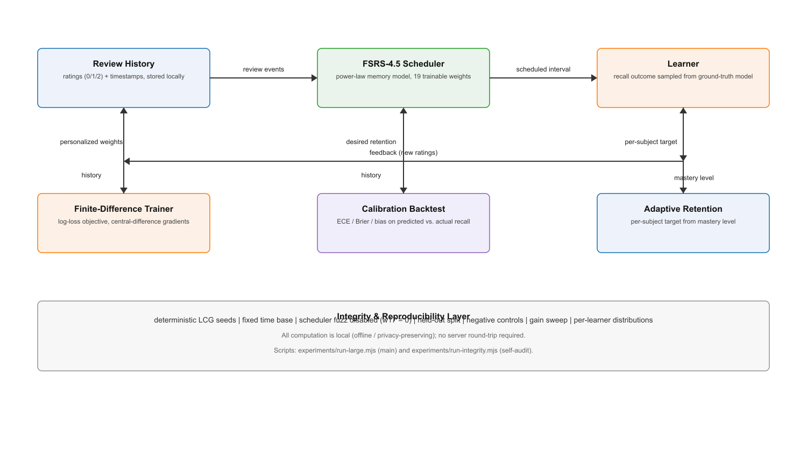

**Fig. 2.** R1b memory-consistent calibration reliability diagram. Predicted recall probability (x-axis) versus observed success rate (y-axis) for matched and mismatched weights. The dashed diagonal represents perfect calibration; bubble area is proportional to bucket sample size.

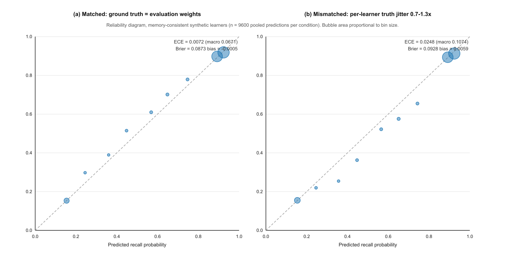

**Fig. 3.** R2 finite-difference training convergence (five seeds), with R2b train/test loss marked. Log-loss versus iteration.

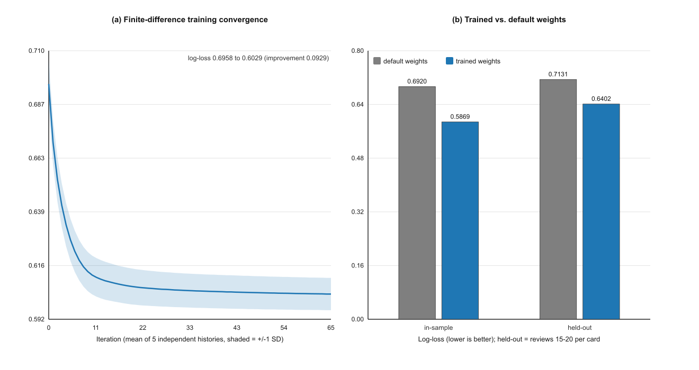

**Fig. 4.** R3 scheduler comparison (200 learners). Total reviews and mean snapshot retention with bootstrap 95% CIs; dashed line marks the 0.90 target.

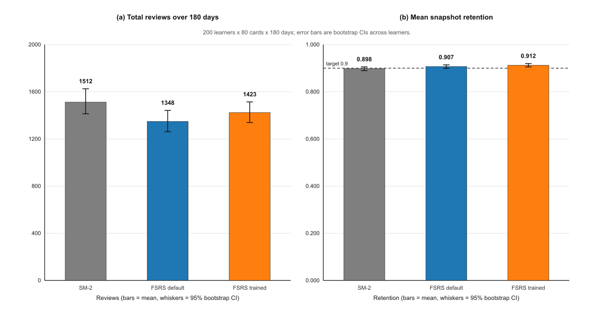

**Fig. 5.** R3 per-learner distribution of review savings vs. SM-2 (200 learners). Each point is one learner; the honest full distribution includes the 27% of learners for whom FSRS is worse.

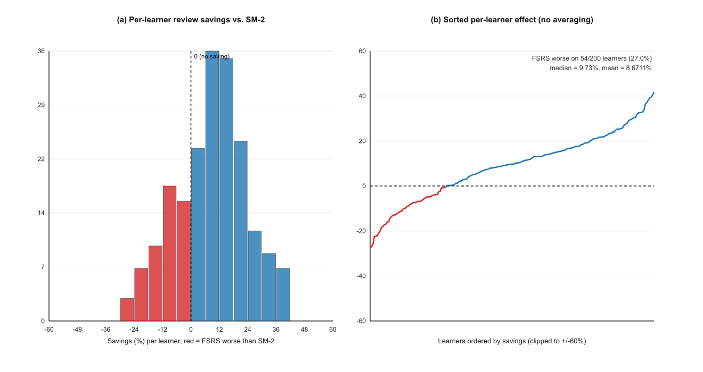

**Fig. 6.** R3b SM-2 mapping sensitivity. Savings vs. SM-2 under generous/neutral/harsh mappings, with the retention gap that confounds the harsh mapping.

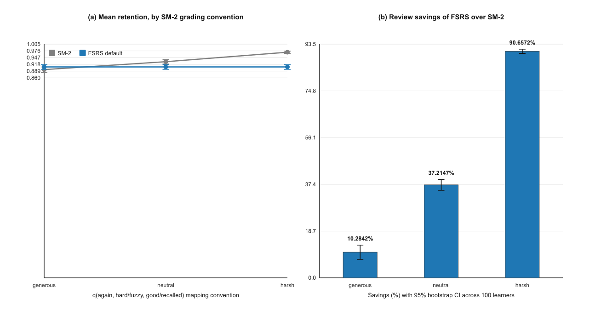

**Fig. 7.** R4 calibration feedback under distribution shift. (a) Bias trace and desired-retention trace for the severe drift. (b) Mean retention for fixed vs. feedback strategy across the three severities.

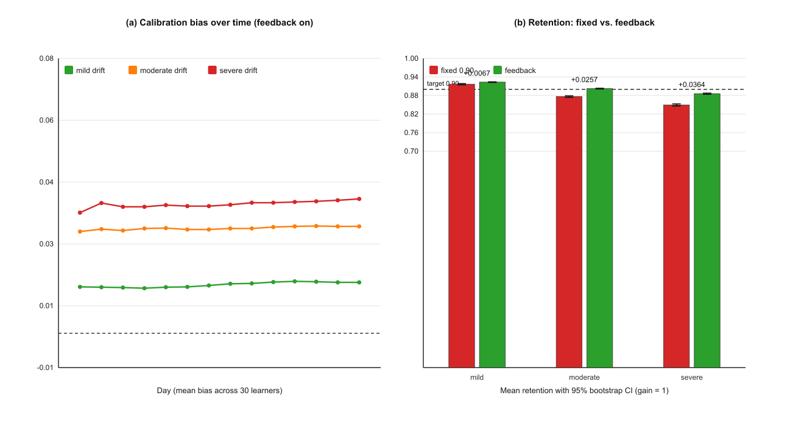

**Fig. 8.** A2 feedback-gain sensitivity. Retention gain and review-cost change as the feedback gain is swept over {0.25, 0.5, 1, 2}; the production default 0.5 is marked.

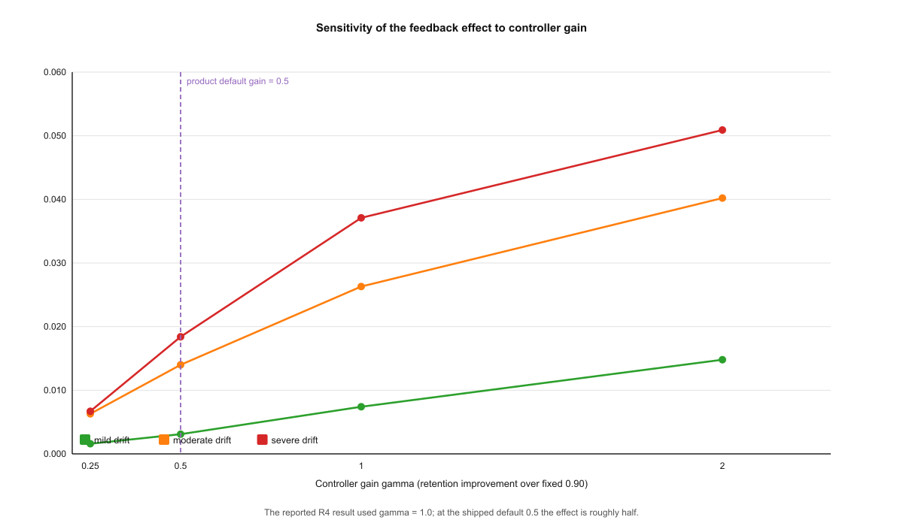

**Fig. 9.** R5 adaptive retention curve. Target retention decreases with subject mastery; three illustrative subjects are annotated.

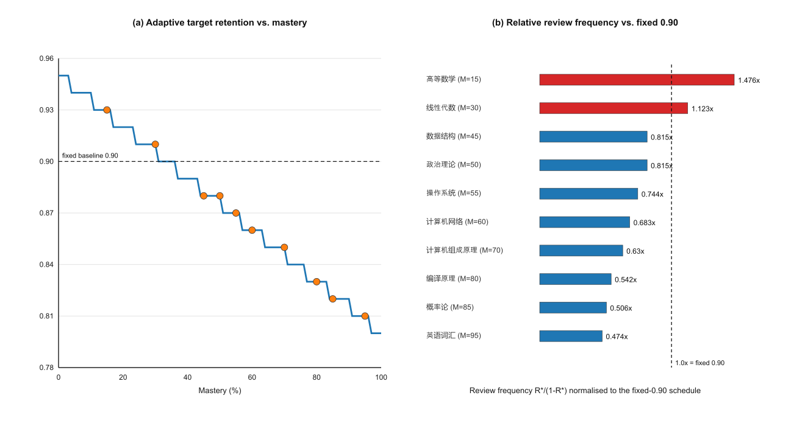

**Fig. 10.** R6 out-of-family ground truth. Review count and retention for SM-2 vs. FSRS under an exponential truth family; the efficiency advantage does not transfer.

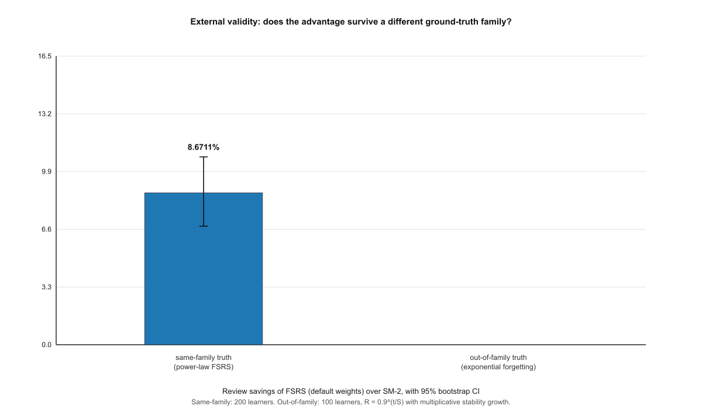

**Fig. 11.** A1b negative control. ECE and |bias| rise monotonically as evaluation weights are mismatched from the data-generating weights, confirming the calibration metric is not vacuous.

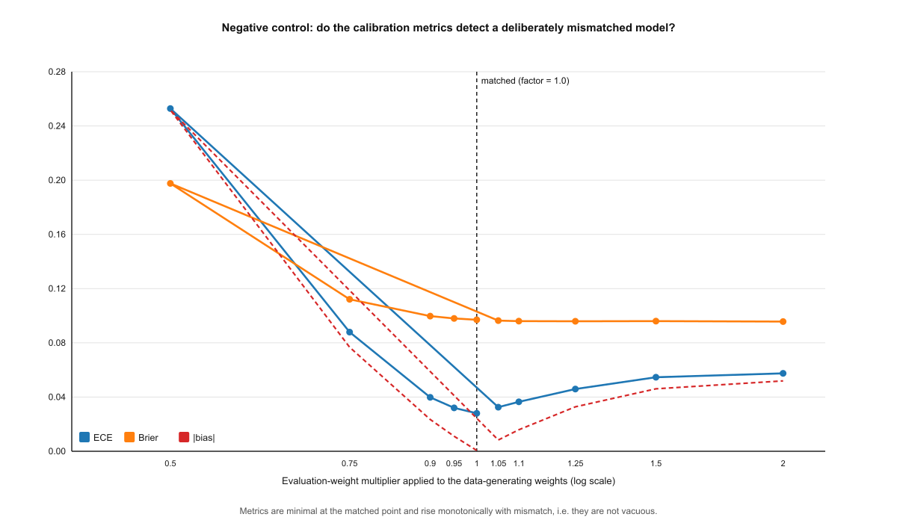

---

## Data Availability and Reproducibility Statement

All data in this study are synthetic and are generated by the deterministic experiment scripts `experiments/run-large.mjs` (main) and `experiments/run-integrity.mjs` (audit) in the SxyBrick repository. The scripts read no external dataset and write `experiments/results-large.json` and `experiments/results-integrity.json`, which are the sole data sources for the tables and figures in this paper. The figure-generation script `experiments/gen-figures-large.mjs` reads those JSON files and produces the PNG files referenced above. Running the scripts twice on the same Node.js version yields byte-identical summary statistics; the audit script independently re-implements the core computations and reproduces the headline numbers exactly. The full academic-integrity audit is documented in `paper/ACADEMIC-INTEGRITY-AUDIT.md`.
